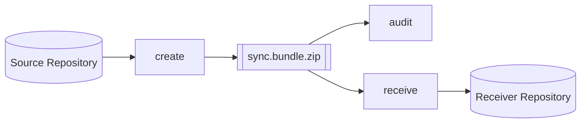
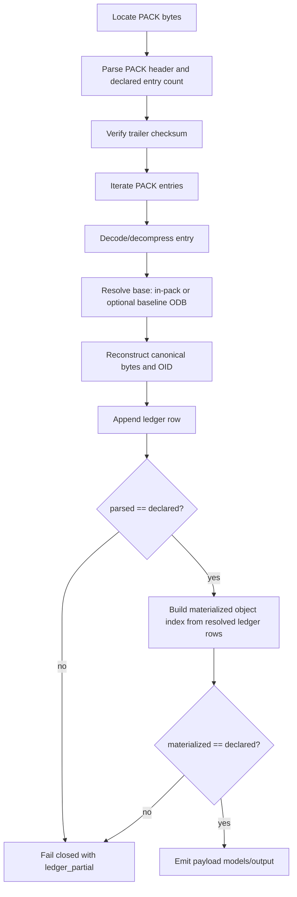

# Software Design and Architecture Description (SDD/SAD)

## 1. Purpose
This document describes the implemented software design of `git-sync` for developers and auditors.

Scope:
- command/runtime architecture
- module decomposition (`src/main.rs`, `src/git/*`, `src/ui/*`)
- package artifacts (`.bundle`, `.caudit.json`, optional `.caudit.patch`, packaged `.zip`)
- audit and proof model (including PACK proofing)
- build/version behavior
- test strategy

## 2. System Context
`git-sync` supports air-gap Git transfer workflows with audit-first review.

Primary command surfaces:
- `create`: produce a transport package from a linear commit range
- `audit` (interactive default): TUI review of history and payload
- `audit --format table|json`: non-interactive payload audit output
  - `--payload-ledger summary|full` (JSON)
  - `--resolve pack-only|baseline` (non-interactive)
- `audit --verify-metadata`: explicit metadata-to-repo verification check
- `receive` (`--dry-run` optional): import package into receiver repo

## 3. Architectural Style
Single-process Rust CLI/TUI with in-process Git operations.

Design characteristics:
- Git operations through `git2` (libgit2 bindings), not shelling out for core logic
- deterministic ordering where possible (sorted rows, stable traversal choices)
- explicit typed domain models (`src/git/types.rs`)
- fail-closed validation for transport/payload proof path
- isolation for risky operations using temporary bare mirrors/repos

## 4. Command Contract (Current)

### 4.1 `create`
`git-sync create --repo --from --to --output [--with-patches]`

Behavior:
- validates `to` is equal to or descendant of `from`
- writes bundle header + PACK payload
- generates `.caudit.json` (and optional `.caudit.patch`)
- archives artifacts into `<output>.zip`
- removes loose `.bundle` and sidecars after packaging (keeps only `.zip`)

### 4.2 `audit`
Interactive mode:
- `git-sync audit --repo --bundle`
- launches TUI (History/Payload views)

Non-interactive payload mode:
- `git-sync audit --repo --bundle --format table`
- `git-sync audit --repo --bundle --format json [--payload-ledger summary|full]`
- optional resolve strategy: `--resolve pack-only|baseline`

Explicit metadata verify mode:
- `git-sync audit --repo --bundle --verify-metadata`
- returns success/failure via exit code and message

Interactive-mode note:
- interactive `audit` currently permits `--resolve pack-only` only

### 4.3 `ui`
`git-sync ui --repo --bundle [--base sync/last] [--tip ...]`

Explicit TUI entrypoint for direct UI launch.

### 4.4 `receive`
`git-sync receive --repo --bundle [--verify-metadata] [--dry-run]`

Behavior:
- supports `.bundle` and `.zip` inputs
- optional metadata integrity verification before import
- dry-run executes import/diff analysis in temporary mirror (no receiver mutation)

## 5. Module Decomposition

### 5.1 Entrypoint / CLI
- `src/main.rs`: command dispatch and output rendering
- `src/cli.rs`: clap models and payload-audit target resolution
- `src/app.rs`: shared `AppConfig`
- `src/version.rs`, `build.rs`: embedded version metadata

### 5.2 Git Domain (`src/git`)
- `bundle/create.rs`: bundle/package creation and cleanup
- `bundle/inspect.rs`: bundle header parsing (`v2`/`v3`, prerequisites, heads)
- `bundle/payload.rs`: payload session, raw PACK-entry ledger proofing, materialized object index, optional baseline-assisted delta resolution, JSON document build
- `bundle/receive.rs`: receive, dry-run, history commit extraction, commit-file patch extraction
- `metadata/collect.rs`: metadata commit-chain/changed-files collection
- `metadata/load.rs`: metadata loading from sidecar
- `metadata/patch.rs`: optional patch sidecar generation
- `metadata/verify.rs`: metadata integrity + metadata-vs-repo truth verification
- `archive.rs`: zip write/extract and artifact path helpers
- `diff.rs`: deterministic diff entry collection
- `context.rs`: base/tip/repo validation helper for UI contexts
- `types.rs`: domain types
- `util.rs`: helper functions (hashing, usernames, hostnames, formatting helpers)

### 5.3 UI Domain (`src/ui`)
- `model.rs`: builds `AuditModel` from repo + bundle inputs
- `runtime.rs`: terminal lifecycle and event loop
- `input.rs`: mode-sensitive key handling
- `render/*`: overview, commit pages, diff view, payload view
- `state/*`: navigation, diff state ops, payload selection/detail ops
- `diff/*`: patch parsing/rendering/highlighting support
- `syntax.rs`: syntax set/theme loading + path-based syntax selection
- `types.rs`: UI state and render model types
- `tests/*`: UI unit tests for input, render, and state behavior

## 6. Artifact and Data Model

### 6.1 Transport Package
`create` produces:
- `<name>.bundle`
- `<name>.bundle.caudit.json`
- optional `<name>.bundle.caudit.patch`
- packaged archive `<name>.bundle.zip`

Distributed artifact is the `.zip`.

### 6.2 Metadata Sidecar (`.caudit.json`)
Schema: `schemas/sync.bundle.caudit.schema.json`

Contains:
- bundle identity (`bundle_size_bytes`, `bundle_sha256`, path/version/heads/prereqs)
- claimed range (`range_from_oid`, `range_to_oid`, `tip_ref`)
- `commit_chain`, `changed_files`
- generation provenance (`generated_*`, `tool_version`)
- optional patch sidecar integrity data

### 6.3 Payload Audit Document (`.paudit` JSON output)
Schema: `schemas/sync.bundle.paudit.schema.json`

Contains:
- top-level package metadata (schema/tool/time/user/host/bundle identity/header data)
- `transport_entries` (`name`, `size_bytes`, `sha256`)
- `pack_proof`
  - `verification_status`
  - `pack_version`
  - compatibility counters: `declared_object_count`, `processed_object_count`
  - entry-truth counters: `entries_declared`, `entries_parsed`, `entries_materialized`
  - materialization counters: `unique_objects_materialized`, `duplicate_entry_count_materialized`
  - transfer gate: `transfer_allowed`, `blocked_reason`
  - `hash_algorithm`
  - `computed_pack_checksum`
  - `trailer_pack_checksum`
- `entry_ledger`
  - `mode`: `summary` or `full`
  - counters: `declared_entries`, `parsed_entries`, `unresolved_entries`
  - subsets: `first_entries`, `last_entries`, `unresolved_entry_rows`
  - optional full rows: `entries` (when mode = `full`)
- `pack_summary`
- `pack_objects` (materialized-object rows, including reachability + context fields)
- `object_details` (renderable content/metadata)

## 7. Runtime Workflows

### 7.1 Create Flow
`create_bundle_with_options`:
1. resolve `from` and `to` commits
2. enforce linear range (`to` descendant-or-equal `from`)
3. build revwalk (`push(to)`, `hide(from)`) and generate PACK
4. write textual bundle header + PACK bytes
5. inspect written bundle header
6. compute metadata (`commit_chain`, `changed_files`, integrity fields)
7. optionally write patch sidecar
8. archive artifacts into `.zip`
9. `main.rs` removes loose `.bundle`/sidecars

### 7.2 Interactive Audit Flow (Default `audit`)
`build_audit_model` assembles:
- Overview:
  - metadata verification result (`verify_bundle_metadata_against_repo_input`)
  - dry-run applicability + would-change stats (`receive ... dry_run=true`)
  - pack-proof summary status derived from payload proof metrics
- History pages:
  - `collect_head_audit_entries_for_bundle_input`
  - per-head commit list (oldest-first), per-commit file stats
- Payload:
  - `open_payload_session`
  - transport entry hashes + PACK-entry ledger + materialized object inventory
  - payload subviews: `Objects` (derived) and `Entries` (authoritative)
  - preview/detail loading with cache

### 7.3 Non-Interactive Payload Audit (`audit --format ...`)
- `--format table`: human-readable payload table
  - PACK proof line (entries/materialized/transfer gate)
  - PACK checksum line
  - ledger summary line (`declared`, `parsed`, `unresolved`)
  - transport entries table
  - materialized object table
- `--format json`: serialized payload audit document (`PayloadAuditDocument`)
  - `--payload-ledger summary|full` controls `entry_ledger` size/content
- `--resolve pack-only|baseline` controls external delta-base resolution policy
  - `pack-only`: strict fail-closed if an external base is required
  - `baseline`: may resolve ref-delta bases from the provided repo ODB

### 7.4 Explicit Metadata Verification (`audit --verify-metadata`)
- verifies metadata integrity against bundle + optional patch sidecar
- verifies metadata range/commit_chain/changed_files against provided repo truth
- prints success message and exits 0 on pass; non-zero on failure

### 7.5 Receive / Dry-Run
`receive_bundle_input_with_options`:
- optional metadata integrity verification
- archive extraction if `.zip`
- import PACK into repo (or dry-run mirror)
- verify head commits exist after import
- update refs (skip already-applied heads)
- dry-run returns per-file line stats without mutating receiver

Idempotency behavior:
- if all advertised heads already applied, returns deterministic no-change result

## 8. PACK Proofing Model (Critical)

Proofing implementation lives in `src/git/bundle/payload.rs` (`verify_pack_payload_with_ledger_and_baseline_odb`).

### 8.1 Authoritative Truth Model
The payload proof model has two layers:
1. **PackEntryLedger (authoritative)**:
   - one row per parsed PACK entry in stream order
   - includes `idx`, `offset`, `kind`, `out_size`, base refs, resolution state/source
2. **MaterializedObjectIndex (derived convenience)**:
   - deduplicated object list for browsing (`Objects` view)
   - derived from resolved ledger rows only

Completeness proof is based on entry counts (`entries_declared`, `entries_parsed`, `entries_materialized`), not ODB enumeration.

### 8.2 What Is Proved
For bundle payload bytes starting at `PACK`:
1. header is valid (`PACK`, version 2/3, declared entry count)
2. trailer checksum matches recomputed checksum
3. exactly `entries_declared` entries are parsed into ledger rows
4. each entry is decoded/decompressed
5. deltas are reconstructed (`ofs-delta` and `ref-delta`)
6. object OID is recomputed from canonical object bytes (`type size\0content`) for materialized entries
7. transfer gate is computed as `entries_materialized == entries_declared`

### 8.3 Resolve Modes
Non-interactive payload audit supports explicit resolve policy:
- `pack-only` (default strict):
  - only in-pack bases may satisfy delta reconstruction
  - unresolved external base => fail-closed
- `baseline`:
  - allows ref-delta base lookup from provided repository ODB
  - resolved entries are marked `resolved_via=baseline`

### 8.4 Fail-Closed Conditions
Audit aborts on:
- invalid/truncated PACK structure
- unsupported entry/header encoding
- zlib stream failures
- delta decode/apply errors
- unresolved delta base references in strict mode
- object size mismatch
- trailer checksum mismatch
- declared/parsed count mismatch
- transfer gate blocked (`entries_materialized < entries_declared`)

Failure output includes actionable partial proof context:
- `PayloadAuditError { reason, blocked_entry_idx, ledger_partial }`

### 8.5 Proof Exposure in Outputs
- TUI overview (`Bundle Integrity`) shows:
  - pack proof status
  - entries parsed and entries materialized counters
  - transfer gate status
  - checksum status
- TUI payload header shows:
  - `entries parsed`, `materialized`, `unique objects`, `duplicates`
  - transfer status
  - pack version/hash/checksums
- Non-interactive table/json outputs expose equivalent entry-truth metrics.
- JSON `entry_ledger` section supports bounded `summary` mode and full export `full` mode.

### 8.6 Current Boundaries
- Hash algorithm currently fixed to SHA-1 for PACK/object verification path.
- Proof failures return errors (no synthetic “failed payload document” is emitted).
- Interactive audit path currently uses pack-only resolve policy.

## 9. UI Interaction Model

Major modes:
- History overview (page 1)
- History commit pages (per selected head)
- Diff view (from selected commit file)
- Payload main view
- Payload object detail view

Key behavior highlights:
- `Tab`/`v` toggle History/Payload from main page
- Payload object list supports `PgUp`/`PgDn` jump-by-10 and `s` sort cycle
- Enter behavior is mode-sensitive:
  - overview: enter selected head
  - history commit page: open file diff
  - payload main: open selected object detail
- Esc behavior is layered:
  - close diff/detail first
  - else return to overview from commit pages
  - else quit from main page

Payload view specifics:
- left-top: transport entries
- left-bottom: subview table (`Objects` or `Entries`)
- right: live preview of selected object
- `e` toggles `Objects` (derived) and `Entries` (proof ledger)
- preview includes object context fields (reachability/head/order/path)
- textual blob preview/detail use syntax highlighting and line numbers

## 10. Auditability Guarantees and Limits

### 10.1 Guarantees
- Create range linearity enforcement.
- Metadata integrity binding (bundle/patch hash+size checks).
- Metadata vs repository truth verification (`audit --verify-metadata`).
- Dry-run isolation from receiver mutation.
- PACK proofing with fail-closed parsing/reconstruction/checksum/entry-count checks.
- Authoritative entry-ledger truth surfaced in TUI (`Entries`) and JSON (`entry_ledger`).
- Transfer gate semantics exposed explicitly (`transfer_allowed`, `blocked_reason`).
- Visibility of unreachable objects via derived materialized-object inventory (`reachable_from_heads=false`).

### 10.2 Limits
- No detached package signature verification yet (authenticity remains out of scope).
- Receive-time `--verify-metadata` validates metadata integrity, not full metadata-vs-repo truth.
- PACK proof path currently SHA-1-centric.
- Interactive audit currently runs with pack-only resolve mode.

## 11. Build and Versioning
- `build.rs` sets `GIT_SYNC_VERSION` with priority:
  1. `GIT_SYNC_VERSION_OVERRIDE`
  2. `git describe --tags --dirty --always` (normalized `v` prefix)
  3. `CARGO_PKG_VERSION` fallback
- CLI/TUI runtime version uses `APP_VERSION` (`src/version.rs`).
- `create` metadata `tool_version` currently uses `CARGO_PKG_VERSION`.
- payload audit document `tool_version` uses runtime `APP_VERSION`.

## 12. Test Strategy
Test layers:
- unit tests in `src/git/tests/*` and `src/ui/tests/*`
- integration tests in `tests/*`

Representative covered areas:
- create/inspect/archive behavior
- metadata integrity and metadata-vs-repo verification
- receive and dry-run idempotency/applicability paths
- head-scoped commit extraction and per-file patch retrieval
- payload session/object detail behavior
- PACK proof mismatch and unresolved delta-base rejection paths
- CLI contract paths (`tests/main_cli_paths.rs`)
- end-to-end workflow (`tests/bundle_workflow_integration.rs`)

## 13. Open TODOs
- Detached package signature verification (authenticity).
- Optional stricter proof artifacting (for example explicit parsed-entry OID set emission/checks).
- Policy-driven receive gates based on audit evidence.
