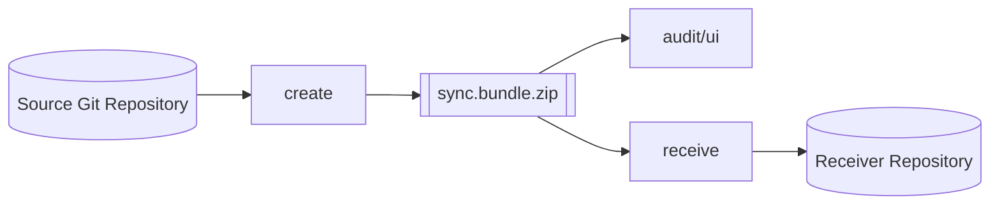
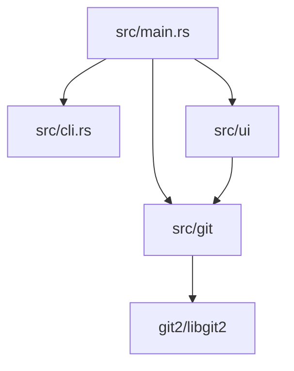
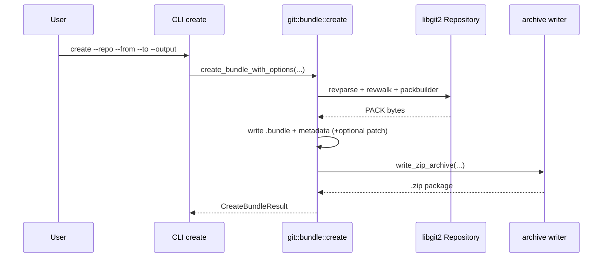
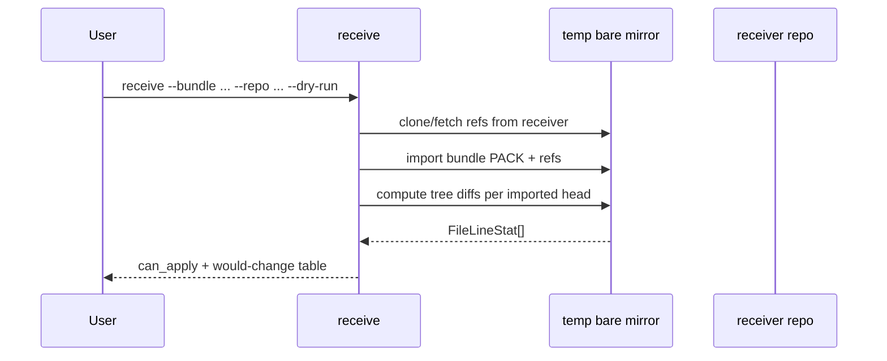
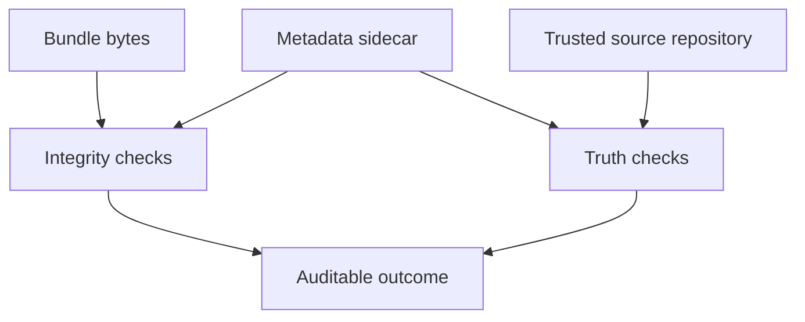

# Software Design and Architecture Description (SDD/SAD)

## 1. Purpose
This document describes the current software design of `git-sync` for developers working on the project.

Scope:
- command and runtime architecture
- module decomposition (`src/git`, `src/ui`, CLI entrypoints)
- data artifacts (`.bundle`, `.caudit.json`, optional `.caudit.patch`, `.zip`)
- auditability model and proof procedure
- build/versioning and test strategy

## 2. System Context
`git-sync` is an offline-oriented Git transfer and audit tool for air-gap workflows.

Primary workflows:
- create package: `create`
- inspect/audit package: `audit` (non-interactive manifest) and TUI (`audit` without `--format` or `ui`)
- verify package metadata against repository truth: `audit --verify-metadata`
- receive package into target repo: `receive` (optionally `--dry-run`)

## 3. Architectural Style
The project is a single-process Rust CLI with explicit module boundaries:
- `src/main.rs`: command dispatch and user-facing flow control
- `src/git/*`: Git-domain operations and package artifacts
- `src/ui/*`: terminal audit UI (Ratatui + Crossterm)

Design characteristics:
- in-process Git logic through `git2`/libgit2 (no git CLI in core paths)
- deterministic, side-effect-minimized audit computations
- strict input validation with explicit errors (`anyhow`)
- optional isolated dry-run receive via temporary bare repository

## 4. Module Decomposition
### 4.1 Entry and CLI
- `src/main.rs`: subcommand dispatch (`create`, `audit`, `ui`, `receive`)
- `src/cli.rs`: Clap models, validation of valid audit mode combinations
- `src/app.rs`: shared runtime config model (`AppConfig`)
- `src/version.rs` + `build.rs`: build-time version embedding

CLI behavior details:
- no subcommand prints scaffold/help guidance text
- `audit` without `--format` enters interactive TUI mode
- `ui` accepts explicit `--base/--tip`; interactive `audit` uses `base_ref=sync/last` and no `tip_ref`

### 4.2 Git Layer (`src/git`)
- `bundle/create.rs`: bundle generation, metadata generation, zip packaging
- `bundle/inspect.rs`: bundle header parser (v2/v3 headers)
- `bundle/receive.rs`: import, dry-run import mirror, line-stat collection, commit patch extraction
- `metadata/collect.rs`: normalized commit chain and changed-file metadata generation
- `metadata/load.rs`: metadata loading for `.bundle` and `.zip` inputs
- `metadata/verify.rs`: integrity checks and repository-truth checks
- `metadata/patch.rs`: optional unified-diff sidecar generation
- `archive.rs`: zip write/extract, sidecar path resolution
- `diff.rs`: deterministic tree diff collection
- `range.rs`: `from`/`to` commit range resolution with descendant check
- `manifest.rs`: TSV/JSON manifest rendering
- `context.rs`: repo/bundle context validation for UI startup
- `types.rs`: shared domain models
- `util.rs`: hashing, status/oid/path helpers

### 4.3 UI Layer (`src/ui`)
- `runtime.rs`: terminal lifecycle and event loop
- `input.rs`: key handling for page and diff modes
- `model.rs`: overview + commit-page model assembly
- `render/*`: page rendering (`overview`, `commit`, `diff`)
- `state/*`: navigation and diff view state mutations
- `diff/*`: patch parsing/rendering + syntax highlighting integration
- `types.rs`: UI data/state models

## 5. Runtime Workflows
### 5.1 Create Package
`create_bundle_with_options`:
1. resolves `from`/`to` commits and checks `to` is equal/descendant of `from`
2. builds revwalk with `push(to)` + `hide(from)`
3. writes bundle header + PACK payload to `.bundle`
4. inspects generated bundle header
5. computes metadata (`commit_chain`, `changed_files`, hashes, heads/prerequisites)
6. optionally writes `.caudit.patch`
7. writes `.caudit.json`
8. writes `.zip` package containing produced artifacts

### 5.2 Non-Interactive Audit
- bundle mode: reads metadata from package input and renders TSV/JSON manifest
- repo range mode: computes diff directly from repo `from..to` and renders TSV/JSON
- verify mode (`--verify-metadata`): executes full metadata-vs-repo verification and prints deterministic OK output

### 5.3 Interactive Audit UI
`ui::model::build_audit_model` eagerly computes:
- overview status (metadata verification and dry-run applicability)
- commit pages (or failure reason)
- syntax-highlighter resources for diff rendering

The first overview page shows:
- tool version
- repo and bundle paths
- metadata verification status
- dry-run applicability and per-file line stats
- heads to import

If dry-run analysis fails, the overview page shows failure details instead of heads/per-file tables.

### 5.4 Receive and Dry-Run
`receive_bundle_input_with_options`:
- optional metadata integrity verification
- supports raw `.bundle` or packaged `.zip`
- imports PACK into ODB and updates refs
- `--dry-run`: imports into temporary bare mirror and computes per-file line deltas without mutating receiver repo

## 6. Data Artifacts
Internal create pipeline produces:
- `<name>.bundle`: git bundle (header + PACK)
- `<name>.bundle.caudit.json`: audit metadata sidecar (schema in `schemas/sync.bundle.caudit.schema.json`)
- `<name>.bundle.caudit.patch` (optional): unified diff across audited range
- `<name>.bundle.zip`: transport artifact containing the above

CLI `create` then removes loose artifacts and leaves only `<name>.bundle.zip` in normal command usage.

Key metadata bindings:
- `bundle_size_bytes` + `bundle_sha256` bind sidecar to exact bundle bytes
- `bundle_header_version`, `prerequisites`, `heads` bind sidecar to parsed bundle header
- `range_from_oid`, `range_to_oid`, `tip_ref` bind claimed audited range
- `commit_chain` + `changed_files` bind presented audit details

## 7. Auditability and Proof Model
### 7.1 Security Objective
For a trusted source repository state, show that:
1. the transported bundle bytes are exactly the bytes audited
2. the presented commit/file audit content is exactly the repository truth for the claimed range
3. receive dry-run predictions are computed from the same imported objects used for actual receive logic

### 7.2 Enforced Invariants
`I1` Range-constrained object export:
- create uses revwalk `push(to)` + `hide(from)` before PACK generation.
- receive import uses explicit PACK indexing into ODB (`git2::Indexer`) and then validates head commit availability and updates refs.

`I2` Artifact immutability binding:
- metadata stores SHA-256 and size of `.bundle`.
- verification recomputes both and fails on mismatch.

`I3` Header-to-metadata consistency:
- verification re-parses bundle header and checks version/prerequisites/heads equality.
- verification checks `tip_ref/range_to_oid` is represented in heads.

`I4` Repo-truth equivalence:
- `verify_bundle_metadata_against_repo*` recomputes `commit_chain` and `changed_files` from the provided repo and requires exact equality.
- any tampering in metadata range claims or file manifest causes verification failure.

`I5` Dry-run/receive algorithm parity:
- dry-run and apply paths share bundle import logic (`apply_bundle_to_repo`).
- dry-run only changes target repo instance (temporary mirror), not algorithm.

### 7.3 Operational Proof Procedure
Recommended verification sequence for high-assurance transfer:
1. produce package via `create` on trusted source repo state
2. run `audit --bundle <pkg> --repo <trusted-source-repo> --verify-metadata --format tsv|json`
3. require `VERIFY OK`
4. run interactive `audit`/`ui` for human review of commit pages and per-file impact
5. run `receive --verify-metadata --dry-run` on receiver to validate applicability and expected impact
6. run `receive --verify-metadata` for actual import

If step 2 succeeds, the audited `commit_chain` and `changed_files` are proven equal to repository truth for the claimed range.

### 7.4 Guarantee Boundaries and Assumptions
Guarantee holds under these assumptions:
- verifier compares against a trusted and correct source repository state
- local libgit2/git object model and cryptographic primitives behave correctly
- filesystem and execution environment are not actively subverted

Important limits:
- package authenticity/signature verification is not implemented yet (see Section 11)
- `receive --verify-metadata` currently checks integrity binding, not full repository-truth equivalence
- Git object IDs are SHA-1 based; this inherits Git’s object identity model and collision assumptions

## 8. Build and Versioning
- `build.rs` resolves `GIT_SYNC_VERSION` using:
  - `GIT_SYNC_VERSION_OVERRIDE` env var (if set)
  - else `git describe --tags --dirty --always`
  - fallback to `CARGO_PKG_VERSION`
- CLI `--version` is provided by Clap using `crate::version::APP_VERSION`
- overview page displays the same embedded version on page 1
- metadata field `tool_version` in `.caudit.json` is currently populated from `CARGO_PKG_VERSION` (not `APP_VERSION`)

Build commands:
- `cargo build`
- `cargo build --release`

## 9. Test Strategy
Test layers:
- unit tests under `src/git/tests` and `src/ui/tests`
- integration tests under `tests/`

Notable integration coverage:
- end-to-end create/audit/verify/receive flow (`tests/bundle_workflow_integration.rs`)
- CLI behavior contracts, including `--version` and dry-run output (`tests/main_cli_paths.rs`)

## 10. Extension Points
Near-term architecture extensions already anticipated by the current structure:
- detached signature generation and verification for package authenticity
- stronger receive-time policy gates (require repo-truth verification result before import)
- additional machine-readable attestations for external compliance pipelines

## 11. Package Authenticity TODO
Planned authenticity design (not implemented yet):
- add detached `Ed25519` signature verification for package authenticity
- signing target: final transfer artifact (`<name>.bundle.zip`) as raw bytes
- planned create output: sibling detached signature file (`<name>.bundle.zip.sig`)
- planned verification inputs on `audit`/`receive`: detached signature + trusted public key
- enforcement goal: reject package when signature is missing or invalid
