# Software Design and Architecture Description (SDD/SAD)
## Project: `git-sync`

## 1. Purpose

This document describes the implemented design of `git-sync` for both engineering and audit audiences. It is written as a development-facing architecture description, but with an explicit emphasis on payload-proof guarantees and air-gap transfer safety.

The main readers are:

- developers extending command behavior, payload processing, or TUI features
- maintainers reviewing design consistency during refactors
- auditors/security reviewers validating proof claims and transfer-gate semantics

The core promise of `git-sync` is that transfer decisions can be made from explicit, inspectable evidence. The tool does not rely on a single convenience view (such as commit reachability or sidecar metadata). Instead, it combines repository truth, metadata truth, and payload truth, with the PACK payload treated as the authoritative source for completeness of transferred content.

This document is intentionally split into a static view and a dynamic view:

- static view: architecture, modules, boundaries, models, and invariants
- dynamic view: runtime command workflows and sequence behavior

## 2. System Context

`git-sync` operates in an air-gap transfer workflow where packaging, review, and controlled import are separate phases. The system context below defines that boundary, the command surfaces used at each phase, and why payload proofing is part of the transfer contract rather than an optional check.

`git-sync` is used in air-gap Git transfer workflows. A producer repository exports a range into a portable package, the package is reviewed on the receiving side, and import is performed only if policy and proof checks pass.

Primary command surfaces:

- `create`: produce a transport package from a linear commit range
- `audit` (interactive default): TUI review of history and payload
- `audit --format table|json`: non-interactive payload audit output
  - `--payload-ledger summary|full` (JSON)
  - `--resolve pack-only|baseline` (non-interactive)
- `audit --verify-metadata`: explicit metadata-to-repo verification check
- `ui`: explicit interactive entrypoint
- `receive` (optional `--dry-run`): import package into receiver repo

High-level workflow:

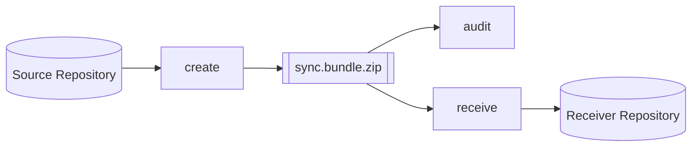

Trust boundary and verification gates:

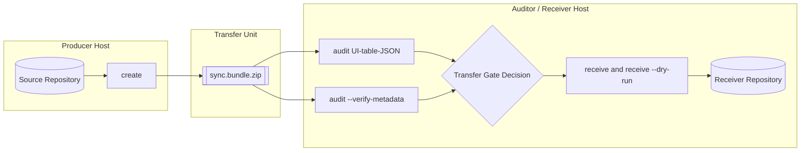

Two audits coexist and solve different problems:

- payload audit (PACK truth): proves what bytes and objects are in the package payload
- metadata verification (repo truth): proves sidecar claims match recomputed repository truth

The payload audit is the key security argument for smuggling resistance and transfer gating.

## 3. Architectural Style

The implementation follows a layered style: command orchestration at the CLI boundary, truth computation in the Git domain, and presentation in the UI layer. Determinism, explicit truth boundaries, and fail-closed behavior are treated as design constraints across all layers.

`git-sync` is a single-process Rust application that combines CLI orchestration and an optional TUI. Core Git operations are performed in-process through `git2`/libgit2. Security-sensitive paths use explicit parsing and proof-boundary types rather than depending on implicit behavior from import side effects.

Architectural characteristics:

- deterministic transformations where possible (stable ordering and predictable rows)
- explicit domain models (`src/git/types/*`) and typed, actionable errors
- fail-closed behavior in payload-proofing and transfer-gate paths
- isolated dry-run receive path via temporary bare mirrors
- separation of truth sources:
  - transport truth (bytes in package)
  - payload truth (PACK entry stream proof)
  - repository truth (range recomputation)
  - metadata truth (sidecar claims)

### 3.1 Quality attributes and acceptance criteria

The quality attributes below are treated as acceptance criteria for architecture changes. A feature that weakens one of these attributes must introduce compensating controls and explicit test coverage.

| Quality attribute | Operational interpretation | Acceptance criteria | Primary evidence |
|---|---|---|---|
| Payload completeness assurance | Transfer decisions are based on PACK entry accounting, not reachability alone | `entries_declared == entries_parsed == entries_materialized` and `transfer_allowed=true` for accepted payloads | `pack_proof` counters, ledger output, payload tests in `src/git/tests/payload_tests.rs` |
| Fail-closed behavior | Parsing or proof ambiguity blocks approval/import paths | Malformed framing, checksum mismatch, unresolved deltas, or counter mismatch produce errors (no synthetic success) | `src/git/bundle/parse.rs`, `src/git/bundle/payload/verify/*`, negative-path tests |
| Deterministic review output | Repeated runs on identical inputs produce stable ordering/counters | Stable table/JSON row ordering and deterministic derived payload projections | deterministic payload tests and UI/render tests |
| Dry-run safety with operational parity | Impact preview uses equivalent import logic without mutating target repo | `receive --dry-run` computes applicability/stats and leaves receiver unchanged | dry-run tests in `src/git/tests/receive_tests.rs` |
| Traceable provenance | Operator-visible evidence includes tool/build identity | version appears in CLI/UI and exported documents/metadata fields | `src/version.rs`, CLI/UI paths, exported documents |

### 3.2 Key architecture decisions and trade-offs

The following decisions capture deliberate architectural trade-offs that shape both implementation and audit posture.

| Decision | Why this was chosen | Trade-off accepted | Future extension path |
|---|---|---|---|
| PACK entry stream is the proof unit | It answers what bytes crossed the boundary | More implementation complexity than simple reachability reporting | Keep reachability as context only; preserve ledger authority |
| Strict bundle framing (no heuristic PACK scan) | Removes ambiguity in payload start and parser behavior | Rejects loosely formatted but potentially recoverable inputs | Maintain strict parse contract; document failures clearly |
| Separate metadata (`.caudit`) from payload proof (`.paudit`) | Keeps claim-verification and byte-proof concerns independent | Two documents to maintain and review | Optional policy profiles can combine both decisions explicitly |
| `pack-only` as strict default resolve policy | Makes hidden external dependencies fail closed | Some payloads require explicit baseline mode | Keep baseline as explicit operator choice with recorded provenance |
| UI is presentation-only for proof data | Prevents renderer changes from altering proof semantics | Additional model/projection layer needed | Continue exposing proof tuple consistently across surfaces |
| Dry-run through temporary mirror | Mirrors receive behavior while preserving receiver state | Extra temporary repo setup cost | Keep parity tests to prevent drift from apply path |

## 4. Static View

The static view captures compile-time structure and ownership boundaries across the codebase. It shows where responsibility sits for routing, proof computation, rendering, and artifact/document modeling.

### 4.1 High-level dependency graph

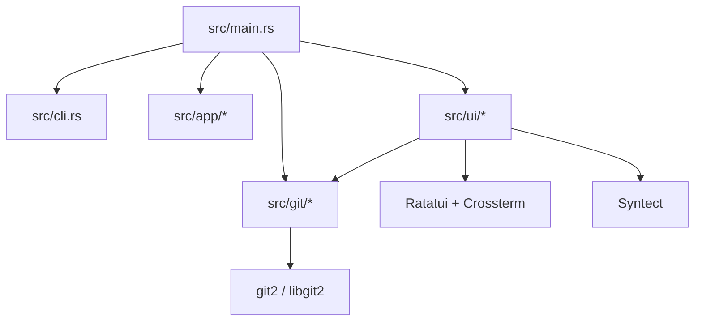

The key separation is intentional: UI is a renderer/state machine, not a proof engine. Parsing, verification, and proof invariants are owned by git-domain modules. UI consumes proof outputs and derived projections.

### 4.2 Command contract and static behavior

#### `create`

`git-sync create --repo --from --to --output [--with-patches]`

`create` validates linearity (`to` must be equal to or descendant of `from`), produces bundle + sidecars, packages them into `<output>.zip`, and then removes loose artifacts in default command flow so that the transport unit is a single archive.

#### `audit`

Interactive mode:

- `git-sync audit --repo --bundle`

Non-interactive payload mode:

- `git-sync audit --repo --bundle --format table`
- `git-sync audit --repo --bundle --format json [--payload-ledger summary|full]`
- optional resolve strategy: `--resolve pack-only|baseline`

Explicit metadata verify mode:

- `git-sync audit --repo --bundle --verify-metadata`

Interactive note:

- interactive `audit` currently permits `--resolve pack-only` only

#### `ui`

`git-sync ui --repo --bundle [--base sync/last] [--tip ...]`

This is the explicit direct TUI entrypoint.

#### `receive`

`git-sync receive --repo --bundle [--verify-metadata] [--dry-run]`

`receive` supports `.bundle` and `.zip` inputs, can verify metadata integrity before import, and can run in dry-run mode against an isolated mirror to avoid receiver mutation.

### 4.3 Module decomposition

This decomposition is organized by **authority**. The command layer decides *what* to run, the git domain computes *truth-bearing data*, and the UI decides *how that data is presented*. That split is what keeps review-oriented rendering concerns from changing proof behavior.

| Layer | Main files | Responsibility | Boundary |
|---|---|---|---|
| Entrypoint + command orchestration | `src/main.rs`, `src/cli.rs`, `src/app.rs`, `src/app/commands/*`, `src/app/output/*`, `src/version.rs`, `build.rs` | Parse CLI input, route mode-specific workflows, format non-interactive output, expose runtime/tool version | Must not implement payload proof logic itself; delegates truth computation to git domain |
| Git domain (authoritative logic) | `src/git/bundle/*`, `src/git/bundle/payload/*`, `src/git/metadata/*`, `src/git/archive.rs`, `src/git/context.rs`, `src/git/diff.rs`, `src/git/range.rs`, `src/git/manifest.rs`, `src/git/digest.rs`, `src/git/util.rs`, `src/git/types/*` | Bundle lifecycle, strict framing, payload verification, metadata collection/verification, receive/dry-run operations, domain data models | Owns proof semantics, fail-closed checks, and transfer gating inputs |
| UI domain (read-only review) | `src/ui/runtime.rs`, `src/ui/model.rs`, `src/ui/input/*`, `src/ui/state/*`, `src/ui/render/*`, `src/ui/diff/*`, `src/ui/syntax.rs`, `src/ui/tests/*` | Build interactive review model, manage navigation/input state, render overview/history/payload/diff pages | Consumes verified and derived data; does not parse/prove payload bytes |

### 4.4 Concrete source module map

This map is intentionally explicit so developers can quickly locate responsibility boundaries.

#### CLI / command layer

| File | Responsibility |
|---|---|
| `src/main.rs` | Process entrypoint and top-level command execution |
| `src/cli.rs` | CLI argument model and validation |
| `src/app/commands/mod.rs` | Command dispatch routing |
| `src/app/commands/create.rs` | `create` command flow |
| `src/app/commands/audit.rs` | `audit` modes and metadata-verify command flow |
| `src/app/commands/receive.rs` | `receive` and dry-run command output flow |
| `src/app/commands/ui.rs` | Direct TUI command entrypoint |
| `src/app/output/{table,sections,layout,kind,json}.rs` | Non-interactive output formatting |

#### Git domain layer

| File | Responsibility |
|---|---|
| `src/git/bundle/create.rs` | Package generation and artifact cleanup |
| `src/git/bundle/inspect.rs` | Bundle header parsing and inspection |
| `src/git/bundle/parse.rs` | Strict bundle framing and PACK extraction |
| `src/git/bundle/payload.rs` | Payload audit API surface |
| `src/git/bundle/payload/verify/{core,preflight,entry,delta,materialized,proof}.rs` | PACK proof pipeline (parse, materialize, invariants) |
| `src/git/bundle/receive.rs` | Receive import path and dry-run analysis |
| `src/git/metadata/{collect,load,patch,verify}.rs` | Metadata sidecar collection, loading, patch support, verification |
| `src/git/archive.rs` | Archive read/write and extraction IO |
| `src/git/context.rs` | Context resolution and precondition checks |
| `src/git/range.rs` | Range validation and resolution utilities |
| `src/git/manifest.rs` | Manifest/table helper logic |
| `src/git/types/*.rs` | Domain and document data models |
| `src/git/digest.rs` | Cryptographic digest helpers |
| `src/git/util.rs` | Generic support helpers |

#### UI layer

| File | Responsibility |
|---|---|
| `src/ui/runtime.rs` | Terminal lifecycle and event loop |
| `src/ui/model.rs` | Audit model construction |
| `src/ui/input/{router,actions}.rs` | Keymap routing and action handling |
| `src/ui/state/{navigation,payload_ops,diff_ops}.rs` | View/navigation/payload state transitions |
| `src/ui/render/overview.rs` | Overview page rendering |
| `src/ui/render/commit.rs` | Commit page rendering |
| `src/ui/render/diff_view.rs` | Diff page rendering |
| `src/ui/render/payload/{mod,layout,tables/*,preview/*,detail,util}.rs` | Payload page rendering stack |
| `src/ui/diff/{parse,render,style}.rs` | Diff parse/render/style helpers |

### 4.5 Artifact model and static data flow

`create` produces the following artifact set:

- `<name>.bundle`
- `<name>.bundle.caudit.json`
- optional `<name>.bundle.caudit.patch`
- packaged `<name>.bundle.zip`

The distributed transport unit is the `.zip` package.

A bundle contains:

- textual header (version, prerequisites, heads)
- mandatory blank-line terminator
- PACK payload beginning with literal `PACK`
- trailer checksum at end of PACK stream

`git-sync` enforces strict framing: it does not scan heuristically for `PACK` in arbitrary bytes; it parses header framing, then requires PACK at the exact boundary.

### 4.6 Metadata and payload document models

Sidecar schemas are versioned and validated in `schemas/`:

- metadata schema: `schemas/sync.bundle.caudit.schema.json`
- payload-audit schema: `schemas/sync.bundle.paudit.schema.json`

`git-sync` intentionally emits two different document types because they answer different questions.

The metadata sidecar (`.caudit.json`) is a **creation-time manifest**. It binds a produced package to a claimed repository range and records provenance/integrity material that can later be verified against both package bytes and repository truth.

| Metadata field group | What it represents | Why it exists |
|---|---|---|
| Bundle identity + integrity | path, size, hashes, bundle header version | Binds claims to concrete package bytes |
| Header linkage | prerequisites and heads extracted from bundle header | Makes bundle transport-level expectations explicit |
| Claimed range | `from`, `to`, `tip_ref` | States the intended logical change interval |
| Range evidence | `commit_chain`, `changed_files` | Human-reviewable and machine-checkable summary of claimed changes |
| Provenance + version | `generated_*`, `tool_version` | Supports traceability of who/when/with-which-tool generated the package |
| Optional patch sidecar integrity | patch path/size/hash/format | Ensures optional patch artifact is bound to same package evidence |

The payload audit document (`.paudit`) is an **audit-time proof/report document**. It describes what was actually proven from PACK bytes under the selected resolve policy and how that proof was projected for review.

| Payload document section | What it contains | How reviewers use it |
|---|---|---|
| Envelope metadata | schema/tool/provenance + bundle identity | Establishes report context and traceability |
| `transport_entries` | transport files with size/hash | Verifies packaged transport components |
| `pack_proof` | verification status, pack version, compatibility counters, entry/materialization counters, transfer gate, checksums | Primary proof tuple for completeness + integrity decisions |
| `entry_ledger` (`summary`/`full`) | authoritative stream-entry accounting with unresolved rows and optional full rows | Direct inspection of PACK entry coverage and failure context |
| `pack_summary`, `pack_objects`, `object_details` | derived object-level views and drill-down detail | Reviewer-friendly browsing after proof is established |

Relationship view of metadata and payload evidence:

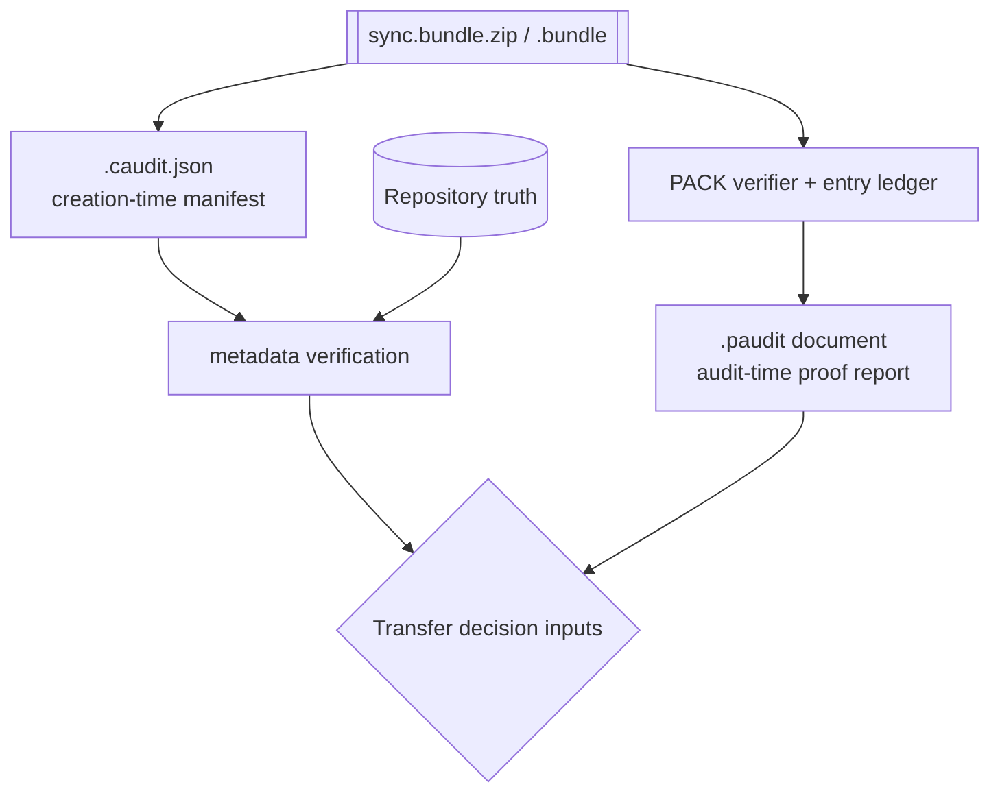

Design consequence: metadata can be fully valid while payload proof fails, and payload proof can succeed even if metadata claims are missing or inconsistent. Therefore transfer-gate decisions that depend on completeness are anchored in payload proof (`pack_proof` + ledger), not metadata alone.

## 5. Dynamic View

Runtime behavior is documented here as command-oriented execution paths, with sequence-level detail for create, audit, payload verification, and receive flows.

### 5.1 Create package sequence

Create sequence:

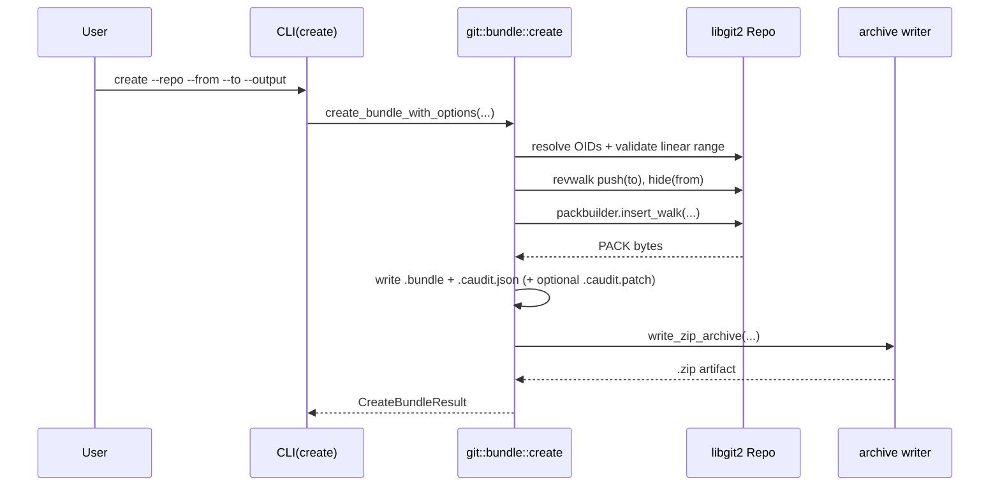

Execution narrative:

1. Resolve `from` and `to`, then enforce linearity (`to` descendant-or-equal `from`).
2. Build revwalk and pack payload.
3. Write bundle bytes and inspect resulting header data.
4. Build metadata (`commit_chain`, `changed_files`, integrity fields).
5. Optionally generate patch sidecar.
6. Archive all artifacts to `.zip` and return command result.
7. Command handler performs loose-artifact cleanup so the archive is the final package unit.

### 5.2 Interactive audit sequence

Interactive audit assembles an `AuditModel` with three logical views: overview, history pages, and payload pages.

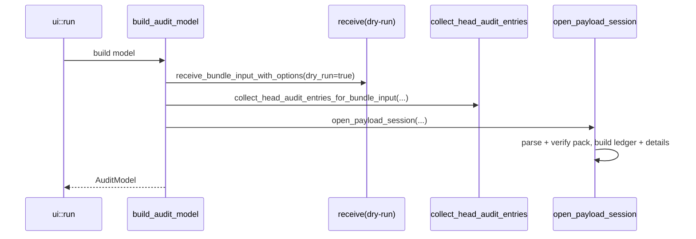

The model is intentionally mixed-source:

- overview combines metadata status, dry-run applicability, and payload proof summary
- history pages explain expected change intent by commit/file evolution
- payload pages expose full PACK-level proof context and object details

The payload page also differentiates between derived and authoritative views:

- `Objects` subview: deduplicated, reviewer-friendly projection
- `Entries` subview: authoritative stream-order ledger used for completeness proof

### 5.3 Non-interactive audit sequence

Non-interactive mode is the automation and archival path. It is deliberately split into different evidence-producing operations so that CI and policy engines can ask a precise question and receive a precise answer.

| Mode | Inputs | Output | Best used for |
|---|---|---|---|
| Payload proof from bundle | `--repo --bundle --format table|json` (optional `--resolve pack-only|baseline`) | Proof counters, checksums, transfer status, transport/object rows, ledger (`summary` or `full`) | Transfer approval workflows, evidence archiving, machine policy checks |
| Repository-range manifest | `--repo --from --to --format ...` | Changed-file manifest from repository truth | Intent review and “what changed in repo terms” reporting |
| Metadata verification | `--verify-metadata --repo --bundle` | Pass/fail with detailed mismatch context | Sidecar integrity and sidecar-vs-repo equivalence checks |

`--format table` is designed for quick human review of the proof tuple. `--format json` emits the full payload-audit document for pipelines and long-term evidence retention.

Object-format guard: the payload proof path currently supports `sha1` object-format repositories only. Non-`sha1` formats are rejected fail-closed before payload parsing begins.

### 5.4 Payload proof runtime sequence

This is the central verification path for transfer safety.

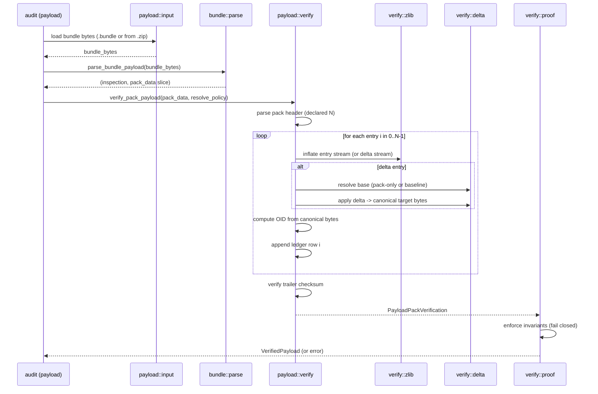

The important behavioral property is that all downstream representations (table output, JSON output, and payload TUI views) are projections of this verified result, not alternate parsers.

### 5.5 Receive and dry-run sequence

Dry-run is designed as operationally faithful but non-mutating.

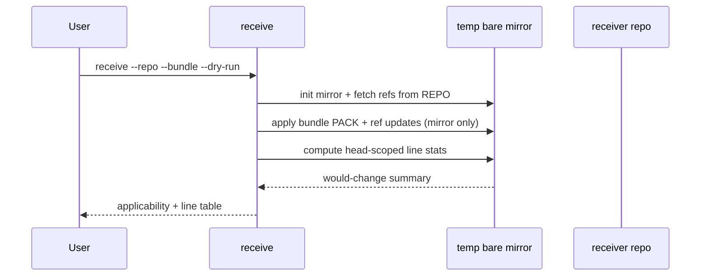

Dry-run and apply are intentionally parallel in logic but different in target:

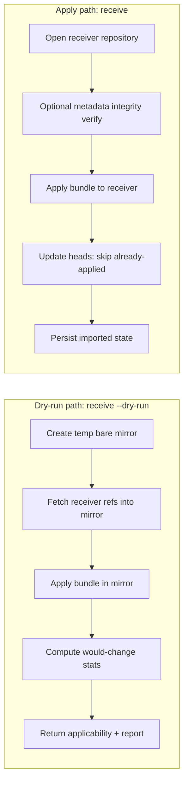

Behavioral points:

- optional metadata integrity checks can run before import
- header framing is parsed strictly (same framing rules as payload audit)
- head existence is verified after import
- ref updates skip already-applied heads (idempotency)
- dry-run computes impact without mutating receiver state

### 5.6 Evidence derivation and consumption flow

The evidence pipeline is designed so every transfer-relevant decision can be traced back to either repository recomputation or payload byte proof, with both paths observable in machine and human outputs.

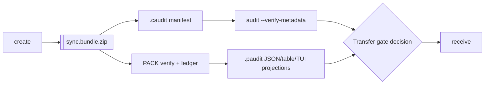

## 6. PACK Proofing Model and Security Argument

Payload proofing is the central assurance mechanism of the project. The following sections define the proof unit, the enforced invariants, and the evidence surfaces used by both operators and automation.

### 6.1 Authoritative truth model

The proof model separates authoritative and convenience layers:

- `PackEntryLedger` (authoritative)
  - one row per parsed PACK entry in stream order
  - includes index, offset, kind, size, base refs, resolution state/source
- materialized-object index (derived)
  - deduplicated object inventory for UI/object browsing
  - derived from resolved ledger rows

Completeness is a property of entry accounting, not of repository reachability enumeration.

### 6.2 What is proved

For the verified PACK payload bytes:

1. PACK preflight is valid (`PACK`, supported version, declared count)
2. trailer checksum matches recomputed checksum
3. exactly `entries_declared` entries are parsed into ledger rows
4. each entry is decoded and inflated
5. delta entries are reconstructed under explicit resolve policy
6. canonical object identity is recomputed for materialized entries
7. transfer gate is allowed only when all declared entries are materialized

### 6.3 Resolve modes and dependency policy

`pack-only` (strict default):

- base objects must be resolvable from in-pack context
- unresolved external base causes fail-closed error

`baseline`:

- `ref-delta` base lookup may use provided baseline ODB
- ledger records this via `resolved_via=baseline`

This makes external dependency usage explicit and auditable.

### 6.4 Fail-closed conditions

Audit/proof aborts on:

- malformed or truncated PACK data
- unsupported/invalid entry encoding
- zlib inflate failures
- delta decode/apply failures
- unresolved delta base under selected policy
- size mismatches
- checksum mismatch
- declared/parsed/materialized counter mismatch

Errors preserve useful context (`reason`, `blocked_entry_idx`, `ledger_partial`) so failure is diagnosable without reducing strictness.

### 6.5 Security argument (selling point)

The security idea behind `git-sync` is that transfer approval must be based on evidence that is both byte-anchored and complete, not on convenience summaries. In practice, this means the proof unit is the PACK entry stream itself. If an object is in the payload, it must appear in the declared entry count and therefore in ledger accounting, whether or not that object is reachable from an advertised head.

This design intentionally avoids the classic failure mode where review tooling only inspects reachable commits and trees. Reachability answers "what is visible from selected refs," but it does not answer "what bytes crossed the boundary." For air-gap workflows, the second question is the one that matters most. The verifier therefore binds claims to exact payload bytes (framing + checksum), enforces exact declared-entry accounting, and only allows transfer when the full tuple is internally consistent.

Operationally, the argument is not "trust this parser." The argument is "observe these invariants and counters that must all align." That is why the same proof tuple is exposed in table output, JSON export, and TUI surfaces. The goal is that a reviewer can reconstruct the decision logic from emitted evidence without needing hidden implementation assumptions.

#### 6.5.1 Threat model and objective

Threat model:

- package may be malformed or crafted to hide unexpected payload content
- metadata may be misleading or stale
- reachability-only views can omit unreachable but present objects

Objective:

- prove complete accounting of payload entries crossing the air-gap boundary
- fail closed when complete accounting cannot be established under policy

#### 6.5.2 Source of truth: PACK bytes

Payload truth comes from the PACK stream bytes, not from sidecar metadata and not from commit reachability alone. This blocks a common class of smuggling attempts where objects are present in payload but not visible in head-reachable views.

#### 6.5.3 Unambiguous PACK identification

`git-sync` parses bundle header framing and requires exact PACK placement after header terminator. No heuristic byte scanning is used. This ties proof to a precise byte range.

#### 6.5.4 Completeness via declared count and exact iteration

The verifier reads declared entry count `N`, appends exactly one ledger row per parsed entry, and enforces `entries_parsed == entries_declared`. Any early stop, overrun, or parse inconsistency fails closed.

#### 6.5.5 Integrity binding via trailer checksum

The trailer checksum binds proof and ledger to exact payload bytes. Byte-level tampering is detected before proof acceptance.

#### 6.5.6 Per-entry validation and canonical identity

Each entry is validated at stream level and reconstruction level:

- decode and inflate checks
- delta input and output-size constraints
- canonical object-id recomputation from object bytes

For delta rows, both stream-size and reconstructed-size semantics are visible and checkable.

#### 6.5.7 Explicit dependency policy

Resolve mode is operator-visible and recorded (`pack-only` vs `baseline`). If external dependency is disallowed and needed, the proof blocks.

#### 6.5.8 Fail-closed transfer gate

Transfer is allowed only when the full proof tuple is consistent. Any violation blocks transfer and returns structured diagnostics.

#### 6.5.9 Smuggling resistance for unreachable objects

Because proof unit is entry stream, unreachable objects are still ledgered and audited. Reachability is rendered as reviewer context, not used as completeness criterion.

#### 6.5.10 Boundaries and non-goals

- current payload proof path assumes SHA-1 PACK/object semantics
- package authorship authenticity is out of scope without separate signing
- proof guarantees payload integrity/completeness, not producer trust

#### 6.5.11 Guarantee summary

When proof succeeds:

- PACK start is unambiguous
- payload bytes are checksum-bound
- declared entry set is fully accounted for in ledger/materialization counters
- transfer-gate acceptance is explicit and policy-bound

#### 6.5.12 Transfer-gate decision tree

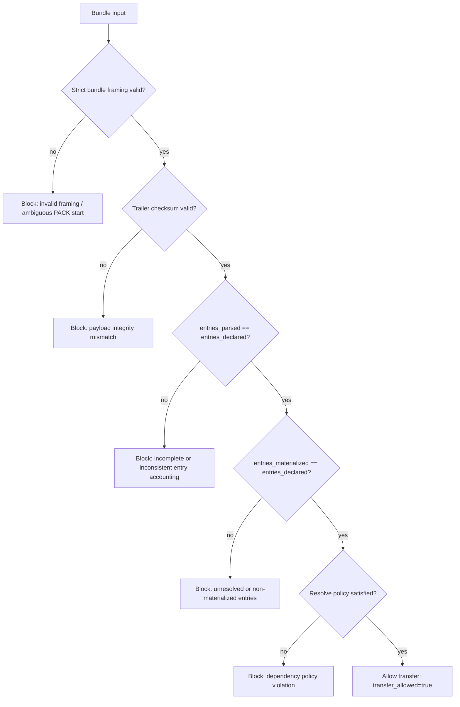

Proof model flow:

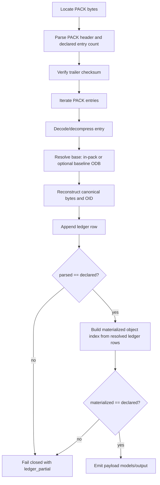

### 6.6 Proof exposure in outputs

Proof evidence is deliberately exposed in every review surface so that operators do not need to “trust hidden internals.” The same core tuple is presented with different levels of detail depending on whether the consumer is a person in a terminal or an automation system.

| Surface | Evidence shown | Typical use |
|---|---|---|
| TUI overview (`Bundle Integrity`) | Proof status, transfer gate state, high-level counters | Fast operator confidence check before drill-down |
| TUI payload page header | Parsed/materialized/unique/duplicate counters and checksum context | Interactive technical review of payload status |
| Non-interactive table | Concise proof tuple + ledger summary | Human-readable CI logs and release artifacts |
| Non-interactive JSON | Full `pack_proof` + `entry_ledger` (`summary`/`full`) + derived object sections | Machine policy, archival evidence, reproducible audit records |

### 6.7 Current proof-path boundaries

- HASH algorithm is currently SHA-1 for PACK/object proof path
- proof failures return errors; no synthetic successful document is emitted
- interactive mode currently enforces pack-only resolve policy

## 7. UI Interaction Model

The UI is implemented as a constrained state machine. It is intentionally read-only in audit flows; state transitions change what is shown, not repository content.

Major modes:

- history overview
- history commit pages
- diff view
- payload main view
- payload object detail view

Key interaction properties:

- `1`, `2`, `3` provide direct navigation shortcuts
- `v` toggles history/payload from main page
- `Tab` switches overview focus between head and would-change tables
- payload supports sort cycling, page jumps, and entry/object subview toggles
- Esc closes deep modes first (diff/detail), then unwinds to overview, then exits

## 8. Auditability Guarantees and Limits

Auditability depends on explicit guarantees and explicit limits. The following sections state what the current implementation can defend, where boundaries remain, and how invariants map to distinct truth sources.

### 8.1 Guarantees

The guarantees listed here are the guarantees the current implementation can defend with code-level evidence and tests. They are intentionally phrased as operational properties, not aspirational goals.

- linear range enforcement during package creation
- metadata integrity binding (hash/size checks)
- metadata-vs-repository truth verification path
- dry-run isolation from receiver mutation
- fail-closed PACK proof pipeline
- authoritative ledger surfaced to UI and JSON
- explicit transfer gate (`transfer_allowed`, `blocked_reason`)
- unreachable-object visibility as context fields
- idempotent receive behavior for already-applied heads

### 8.2 Limits

These limits define where additional controls are still needed. They are not hidden caveats; they are part of the explicit trust boundary of the current design.

- no detached package signature verification yet (authenticity out of scope)
- receive-time `--verify-metadata` focuses on metadata integrity, not full repo-truth recomputation by default path
- payload proof supports SHA-1 object format only today
- interactive audit currently runs with pack-only resolve mode

### 8.3 Truth sources and invariant mapping

For design reviews and audits, the most important discipline is to avoid mixing truth sources. The table below makes explicit which subsystem is authoritative for which claim.

| Review surface / command | Authoritative source | What it proves | What it does not prove |
|---|---|---|---|
| Payload audit (`audit` payload table/json, interactive payload views) | Strict bundle framing + PACK verifier + ledger/proof invariants | PACK payload completeness and integrity under resolve policy | Metadata correctness or producer authenticity |
| Metadata verification (`audit --verify-metadata`) | Sidecar integrity checks + repository recomputation equivalence | Sidecar claims match package and repository truth | PACK completeness by itself |
| History views (interactive commit/file pages) | Imported graph traversal + commit/file extraction | Human-readable change intent/context | Full payload coverage |
| Receive / dry-run | Import/apply behavior in receiver or mirror | Operational applicability and impact | Replacement for payload proof checks |

The architectural invariants that tie these surfaces together are:

| Invariant | Definition | Enforced by |
|---|---|---|
| I1 | Create-range linearity (`from..to` is linear-descendant or equal) | `create` range resolution/validation |
| I2 | Metadata transport integrity (bundle/patch hash-size bindings) | metadata integrity verification |
| I3 | Metadata-vs-repo equivalence (`commit_chain` / `changed_files`) | metadata verify against repository recomputation |
| I4 | Payload proof tuple consistency (framing, checksum, declared/parsed/materialized counters) | PACK verifier + proof boundary checks |
| I5 | Receive idempotency (already-applied heads skipped deterministically) | receive/import head application logic |
| I6 | Dry-run/apply parity (same import logic, isolated target) | dry-run mirror execution model |

### 8.4 Claim-to-implementation traceability matrix

This matrix links the document's assurance claims to concrete implementation files and representative executable tests. It is intended as a maintenance guardrail: if code or tests move, this table should be updated with the same rigor as the claim text.

| Claim | Invariant(s) | Primary code locations | Representative tests |
|---|---|---|---|
| Create rejects non-linear ranges | I1 | `src/git/bundle/create.rs`, `src/git/range.rs` | `create_bundle_fails_when_to_commit_is_not_descendant_of_from_commit`, `open_context_fails_when_tip_ref_is_not_descendant_of_base_ref` |
| Metadata integrity binds claims to transport artifacts | I2 | `src/git/metadata/verify.rs`, `src/git/metadata/load.rs` | `verify_bundle_metadata_integrity_rejects_header_version_mismatch`, `verify_bundle_metadata_integrity_rejects_patch_sidecar_sha_mismatch` |
| Metadata claims match repository truth when verified | I3 | `src/git/metadata/collect.rs`, `src/git/metadata/verify.rs` | `verify_bundle_metadata_against_repo_rejects_commit_chain_mismatch`, `verify_bundle_metadata_against_repo_rejects_changed_files_mismatch` |
| Payload completeness and integrity are enforced fail-closed | I4 | `src/git/bundle/parse.rs`, `src/git/bundle/payload/verify/*`, `src/git/bundle/payload/verify/proof.rs` | `bundle_pack_offset_is_read_from_header_not_scanned`, `verify_pack_payload_validates_trailer_checksum`, `pack_ledger_contains_exactly_declared_entry_count`, `strict_mode_blocks_when_unresolved_entries_remain` |
| Re-applying same package is idempotent | I5 | `src/git/bundle/receive.rs` | `receive_bundle_input_is_idempotent_when_same_package_is_applied_twice`, `receive_dry_run_prints_no_changes_when_head_already_applied` |
| Dry-run mirrors receive logic without mutating target repo | I6 | `src/git/bundle/receive.rs`, `src/app/commands/receive.rs` | `receive_bundle_input_with_options_dry_run_does_not_modify_receiver_repo`, `receive_dry_run_prints_would_change_table_for_pending_import` |

## 9. Build and Versioning

Build and version handling are defined to keep identity traceable from compilation to runtime and exported audit artifacts. The details below describe resolution order and where version values are surfaced.

Version resolution order:

1. `GIT_SYNC_VERSION_OVERRIDE`
2. `git describe --tags --dirty --always` (normalized `v` prefix)
3. `CARGO_PKG_VERSION` fallback

Version usage:

- runtime version (`APP_VERSION`) is used by CLI/TUI (`--version` and UI overview)
- create metadata currently carries package/tool version fields for traceability
- payload audit document includes runtime tool version in exported evidence

## 10. Test Strategy

The suite is structured to preserve command behavior, proof invariants, and UI consistency.

Test layers:

- unit tests in `src/git/tests/*` and `src/ui/tests/*`
- integration tests in `tests/*`

Representative covered areas:

- create/inspect/archive behavior
- metadata integrity and metadata-vs-repo verification behavior
- receive and dry-run applicability/idempotency paths
- commit and file-level extraction for review pages
- payload session/object detail behaviors
- PACK mismatch and unresolved-delta rejection paths
- CLI path contracts (`tests/main_cli_paths.rs`)
- end-to-end workflow (`tests/bundle_workflow_integration.rs`)

## 11. Operational Auditor Checklist

The checklist below translates proof invariants into a practical transfer-review procedure. It focuses on the minimum evidence tuple that must hold before approval.

When an auditor asks whether the displayed payload is complete, show these values together:

- checksum verified: `true`
- `entries_declared = N`
- `entries_parsed = N`
- `entries_materialized = N`
- `transfer_allowed = true`

Explain that PACK declares `N`; ledger parsing and materialization both prove accounting for all `N`; checksum binds that accounting to exact bytes. Any mismatch blocks transfer.

## 12. Boundaries and Assumptions

Guarantees hold only within stated environmental and cryptographic assumptions. The assumptions and non-goals below define where additional controls are required for stronger assurance claims.

Guarantees depend on:

- correct local execution environment (tool/process not subverted)
- correct PACK format semantics and parser adherence
- cryptographic primitive assumptions for SHA-1/SHA-256 checks

Non-goals in current implementation:

- detached authenticity/signature framework
- trust attestation of producer machine/runtime

## 13. Open TODOs

Open items are tracked here as intentionally deferred architecture and assurance work. The list is scoped to changes that materially improve trust guarantees, compatibility, or policy integration.

- detached package signature verification (authenticity)
- optional stricter proof artifacting (for example explicit parsed-entry OID set emission/checks)
- object-format-aware payload proofing (phase 6b)
  - add SHA-256-capable object-id/hash abstraction (remove hardwired SHA-1 assumptions)
  - parse PACK trailer and ref-delta base IDs with algorithm-specific hash length
  - make baseline-assisted delta resolution and reporting algorithm-aware end-to-end
- policy-driven receive gates based on audit evidence

## 14. Appendix: Code locations for proof claims

This appendix provides claim-to-code traceability for design and audit review. Each proof claim is mapped to the concrete modules that enforce it.

- strict bundle framing: `src/git/bundle/parse.rs`
  - header parse through blank line, then exact PACK slice extraction
- PACK verification and ledger: `src/git/bundle/payload/verify.rs` and `verify/*`
  - preflight parse, entry iteration, inflate/delta reconstruction, checksum verification
  - ledger and materialized-store creation
- proof invariants: `src/git/bundle/payload/verify/proof.rs`
  - fail-closed boundary checks (`VerifiedPayload`)
- payload session/export mapping:
  - `src/git/bundle/payload/session.rs`
  - `src/git/bundle/payload/document.rs`
  - `src/git/bundle/payload/detail.rs`
  - `src/git/bundle/payload/context.rs`
