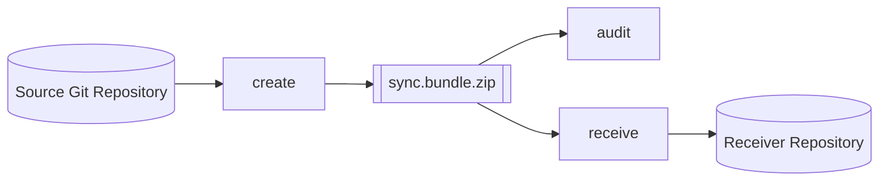
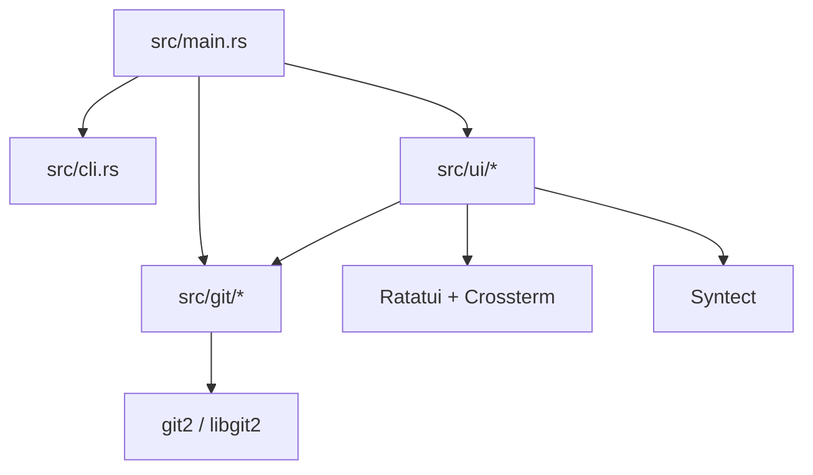
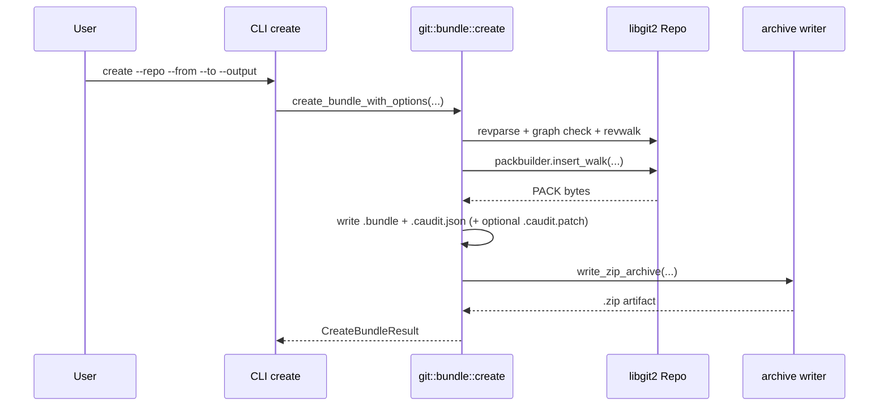
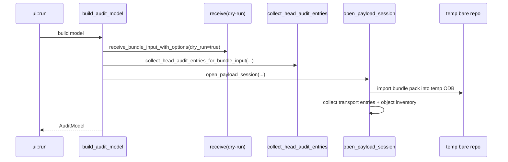
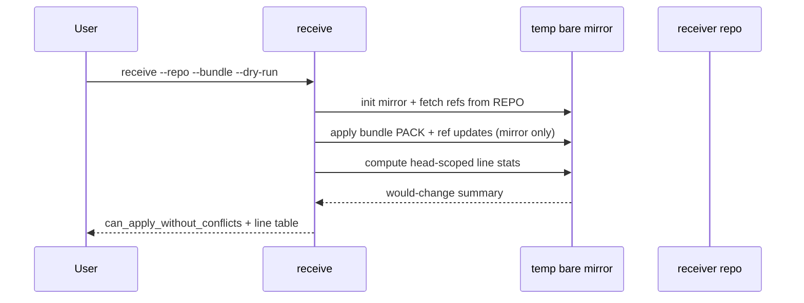
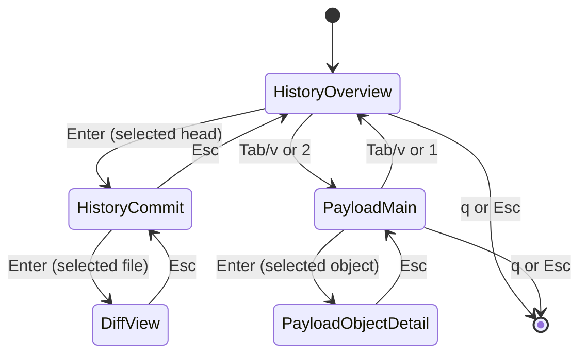

# Software Design and Architecture Description (SDD/SAD)

## 1. Purpose
This document describes the current software design of `git-sync` for developers and auditors working on the project.

Scope:
- command/runtime architecture
- module decomposition (`src/main.rs`, `src/git/*`, `src/ui/*`)
- package artifacts (`.bundle`, `.caudit.json`, optional `.caudit.patch`, `.zip`)
- auditability model and guarantees
- build/versioning and test strategy

## 2. System Context
`git-sync` is an offline-oriented Git transfer and audit tool for air-gap workflows.

Primary workflows:
- create transport package: `create`
- inspect package:
  - interactive: `audit` without `--format` (preferred)
  - non-interactive: `audit --format tsv|json`
- verify metadata against repository truth: `audit --verify-metadata --format ...`
- receive into target repository: `receive` (optionally `--dry-run`)

## 3. Architectural Style
The project is a single-process Rust CLI with explicit module boundaries and no shell-outs in core Git logic.

Design characteristics:
- in-process Git operations via `git2`/libgit2
- deterministic data transformations where possible (sorted manifests, stable rendering order)
- explicit validation and typed errors (`anyhow`)
- isolation for risky operations (`receive --dry-run` in temporary bare mirror)
- separation between transport-level inspection and repository-truth verification

## 4. Module Decomposition

### 4.1 Entry and Command Dispatch
- `src/main.rs`: top-level command routing and mode wiring
- `src/cli.rs`: Clap models and audit-mode argument resolution
- `src/app.rs`: shared `AppConfig`
- `src/version.rs` + `build.rs`: runtime version embedding

Command groups:
- `create`: build package from linear `from..to` range
- `audit`: interactive TUI or non-interactive TSV/JSON
- `ui`: explicit interactive entrypoint (with manual `--base/--tip`)
- `receive`: import package into receiver repo (`--verify-metadata`, `--dry-run`)

### 4.2 Git Domain (`src/git`)
- `bundle/create.rs`: bundle generation, metadata generation, optional patch, zip packaging
- `bundle/inspect.rs`: bundle textual header parsing (`v2`/`v3`, prerequisites, heads)
- `bundle/receive.rs`: receive/apply/dry-run, commit-page data collection, per-file patch extraction
- `bundle/payload.rs`: payload session, transport entry inventory, pack-object inventory, object detail rendering
- `metadata/collect.rs`: metadata commit chain + changed files
- `metadata/load.rs`: metadata loading from `.bundle` or `.zip`
- `metadata/verify.rs`: integrity checks and repository-truth checks
- `metadata/patch.rs`: optional patch sidecar generation
- `archive.rs`: archive write/extract and sidecar path resolution
- `diff.rs`: deterministic changed-file collection
- `range.rs`: linear range validation/resolution for repo-range audit
- `manifest.rs`: TSV/JSON rendering
- `types.rs`: shared domain models
- `util.rs`: OID/status/path/hash helpers and host/user capture

### 4.3 UI Domain (`src/ui`)
- `model.rs`: builds `AuditModel` (overview, commit pages, payload, syntax resources)
- `runtime.rs`: terminal lifecycle + event loop
- `input.rs`: key mapping and mode-sensitive input dispatch
- `state/*`: navigation, diff operations, payload operations
- `render/*`: overview page, commit page, diff view, payload page
- `diff/*`: unified diff parse + syntax-aware render
- `syntax.rs`: syntax/theme loading and syntax detection
- `types.rs`: UI data/state types
- `tests/*`: isolated UI behavior tests (input, rendering, state transitions)

## 5. Data and Artifact Model

### 5.1 Transport Artifact Structure
Create pipeline produces:
- `<name>.bundle`
- `<name>.bundle.caudit.json`
- optional `<name>.bundle.caudit.patch` (when `--with-patches`)
- packaged `<name>.bundle.zip`

CLI `create` keeps only `<name>.bundle.zip` by default and removes loose sidecars/bundle.

### 5.2 Metadata Sidecar Binding
Metadata (`schema_version: "1"`) captures:
- bundle identity: path, byte size, SHA-256
- bundle header linkage: version, prerequisites, heads
- claimed range: `range_from_oid`, `range_to_oid`, `tip_ref`
- audit views: `commit_chain`, `changed_files`
- optional patch sidecar integrity: path, format, size, SHA-256
- generation provenance: timestamp, username, hostname

Schema source: `schemas/sync.bundle.caudit.schema.json`.

### 5.3 Runtime Models
Core runtime structures:
- `ReceiveBundleResult`: bundle version, imported heads, can-apply flag, dry-run line stats
- `HeadAuditEntry`: per-head line stats + per-commit summaries
- `PayloadAudit`: transport entry list + pack-object list
- `PayloadObjectDetail`: per-object detail text/preview metadata

Interactive model (`AuditModel`) bundles:
- `overview` (metadata verification + dry-run status)
- `commit_pages` (head-scoped commit graph view)
- `payload` + optional `payload_session` (for cached object detail queries)

## 6. Runtime Workflows

### 6.1 Create Package
`create_bundle_with_options`:
1. resolve/validate `from` and `to` commits (`to` must be same/descendant of `from`)
2. build revwalk (`push(to)`, `hide(from)`)
3. generate `.bundle` header + PACK payload
4. inspect generated bundle header
5. compute metadata (`commit_chain`, `changed_files`, integrity fields)
6. optionally write `.caudit.patch`
7. write `.caudit.json`
8. package selected artifacts into `.zip`

### 6.2 Non-Interactive Audit
Audit non-interactive has three distinct modes:

1. Bundle manifest mode:
- input: `--bundle`, `--format`
- source of truth: metadata `changed_files` from package
- output: TSV/JSON manifest

2. Repository range mode:
- input: `--repo`, `--from`, `--to`, `--format`
- source of truth: direct tree diff in repository
- output: TSV/JSON manifest

3. Metadata verification mode:
- input: `--bundle`, `--repo`, `--verify-metadata`, `--format`
- validates metadata integrity and repository-truth equivalence
- output:
  - TSV: `VERIFY\tOK`
  - JSON: `{"verification":"ok"}`

### 6.3 Interactive Audit (History + Payload)
`build_audit_model` eagerly computes:
- overview:
  - metadata verification against `--repo`
  - dry-run applicability (`receive ... dry-run`) and line stats
- history pages:
  - `collect_head_audit_entries_for_bundle_input(...)`
  - per head: commits (oldest->newest) and per-head line stats
- payload page:
  - `open_payload_session(...)`
  - transport entry inventory (`zip` members or plain bundle)
  - object inventory from imported temporary ODB
  - object detail served through reusable session + caches

Key behavior:
- overview page selects current head
- selected head drives both:
  - `Would Change` table content
  - commit page chain when entering history
- payload page supports:
  - canonical/context sort (`s`)
  - preview panel
  - drill-down object detail view

### 6.4 Receive and Dry-Run
`receive_bundle_input_with_options`:
- optional integrity verification (`verify_bundle_metadata_integrity_input`)
- supports `.bundle` and `.zip`
- import path:
  - parse header (`inspect_bundle`)
  - import PACK via `git2::Indexer`
  - verify head commits exist post-import
  - update refs (skip already-applied heads)

Dry-run specifics:
- uses `TempBareRepo::from_existing(receiver_repo_path)` (fetched mirror)
- applies identical bundle-import logic to mirror
- computes per-file line deltas without mutating receiver repo
- prints applicability summary + aligned would-change table

Idempotency specifics:
- if all advertised heads are already applied, receive exits with deterministic no-change result

## 7. UI Interaction Model

### 7.1 View/Mode State Machine
Interactive UI has five major modes:
- history overview
- history commit pages
- diff view (history file patch)
- payload main page
- payload object detail

### 7.2 Rendering and Input Highlights
- overview:
  - `Heads To Import` table (selected row)
  - `Would Change` for selected head
- history commit page:
  - head index, commit index (`n/m`)
  - author/committer identities and timestamps
  - changed file table with `+LINES/-LINES`
- diff view:
  - first-parent unified patch
  - old/new line number columns
  - semantic + syntax-aware coloring
- payload main:
  - top-left transport entries
  - bottom-left full pack object table
  - right-side live preview (with truncation marker)
- payload detail:
  - full object text with line-number gutter and scrolling

Non-text behavior:
- binary/symlink line stats reported as `0/0`
- opening diff for non-text file is ignored (no hard failure in UI)

## 8. Auditability Model

### 8.1 Truth Sources by Command Surface
- `audit --format ... --bundle`:
  - truth source: metadata sidecar (`changed_files`)
- `audit --verify-metadata --repo --bundle --format ...`:
  - truth source: metadata + repository recomputation
- interactive `audit` history pages:
  - truth source: imported bundle object graph + head traversal
- interactive `audit` payload page:
  - truth source: imported temporary ODB object inventory

This separation is intentional: metadata reporting and object-graph inspection are both available and explicit.

### 8.2 Enforced Invariants
`I1` Linear range creation:
- `create` rejects non-linear `from..to`.

`I2` Package integrity binding:
- metadata stores bundle size + SHA-256.
- verification recomputes and must match.

`I3` Header-metadata consistency:
- verification re-parses bundle header and checks version/prerequisites/heads.

`I4` Metadata repository-truth equivalence:
- `audit --verify-metadata` recomputes `commit_chain` and `changed_files` from repo and requires exact equality.

`I5` Receive idempotency:
- already-applied heads are detected and skipped.
- fully-applied package yields deterministic no-change result.

`I6` Dry-run/apply parity:
- dry-run uses same bundle-import logic as real receive, but on isolated mirror.

`I7` Payload visibility:
- payload view enumerates all objects present in the temporary imported ODB for the audited bundle input.
- reachability is explicitly marked relative to advertised heads.

### 8.3 Recommended High-Assurance Procedure
1. create package on trusted source repo
2. run interactive `audit --repo <source> --bundle <pkg>` for human review
3. run `audit --verify-metadata --repo <source> --bundle <pkg> --format tsv|json` for machine-verifiable source-truth proof
4. transfer package across air gap
5. run interactive audit on target side (`--repo <target>`) to review import impact in receiver context
6. run `receive --verify-metadata --dry-run` on target to confirm applicability
7. run `receive --verify-metadata` for actual import

### 8.4 Boundaries and Assumptions
Guarantees depend on:
- trusted repository state used for verification
- correct libgit2/object model behavior
- non-subverted local execution environment

Current limits:
- no detached package signature verification yet
- `receive --verify-metadata` performs metadata integrity checks, not full repository-truth equivalence
- payload inventory is derived from imported ODB enumeration (not direct PACK stream parsing/count proof)

## 9. Build and Versioning
- `build.rs` injects `GIT_SYNC_VERSION` at compile time:
  1. `GIT_SYNC_VERSION_OVERRIDE` environment override
  2. else `git describe --tags --dirty --always` (normalized `v` prefix)
  3. fallback `CARGO_PKG_VERSION`
- CLI `--version` and UI overview consume the embedded `APP_VERSION`.
- metadata `tool_version` currently uses `CARGO_PKG_VERSION`.

## 10. Test Strategy
Test layers:
- unit tests in `src/git/tests/*` and `src/ui/tests/*`
- integration tests in `tests/*`

Representative coverage areas:
- create/inspect/metadata integrity/truth verification
- receive path (normal + dry-run + rainy-day failures)
- head-scoped history audit extraction
- payload audit collection + object detail behavior
- UI input/state/render contracts (history, payload, diff, help/footer behavior)
- end-to-end workflow (`tests/bundle_workflow_integration.rs`)
- CLI command-path contracts (`tests/main_cli_paths.rs`)

## 11. Open TODOs
Planned but not implemented:
- detached package signature verification (e.g. Ed25519) for authenticity
- stronger policy gates for receive-time enforcement based on verification evidence
- optional direct PACK parser mode for entry-count level completeness proof
