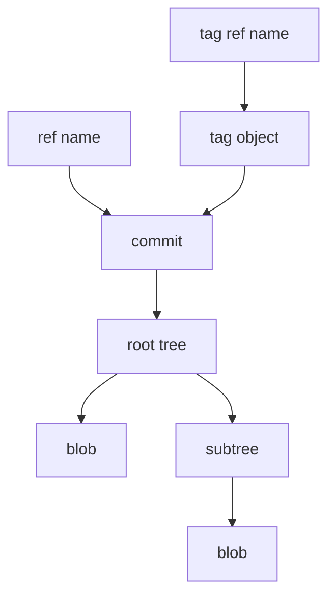
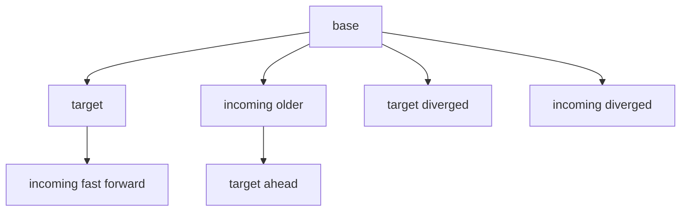

# Git Fundamentals for `git-sync`

This document is a focused refresher on Git concepts that are essential to understand how `git-sync` creates, audits, and receives bundle packages. It intentionally covers Git internals (objects, refs, bundles, PACK files, deltas, merge behavior), because the project deals with those structures directly.

It is not a general Git tutorial. It aims to make the terminology used in the codebase and in `docs/SDD_SAD.md` self-contained.

## 1. The Object Database (ODB) and OIDs

Git stores almost everything as *content-addressed objects* in the object database (ODB). Each object is identified by an **object ID** (**OID**).

- In SHA-1 repositories (the only object format currently supported by `git-sync`), OIDs are 20 bytes and usually displayed as 40 hex characters.
- The OID is a hash of the object in a canonical format:
  - `"<type> <size>\\0<raw-bytes>"` hashed with SHA-1
  - Example types: `blob`, `tree`, `commit`, `tag`

Two storage layouts coexist:

- **Loose objects**: individual compressed files under `.git/objects/aa/bb...`
- **Packed objects**: many objects stored together in `.pack` files with `.idx` index files under `.git/objects/pack/`

`git-sync` needs these fundamentals because it:

- verifies payload content by reconstructing objects and recomputing OIDs
- imports objects by writing PACK data into the receiver repository

Useful inspection commands:

```bash
git cat-file -t <oid>      # object type
git cat-file -s <oid>      # object size
git cat-file -p <oid>      # pretty-print object content
```

## 2. Core Object Types: `blob`, `tree`, `commit`, `tag`

### 2.1 Blob

A **blob** is file content (bytes). Blobs have no filename; names live in trees.

### 2.2 Tree

A **tree** is a directory listing. It contains entries:

- name (path component)
- mode (file permissions / kind)
- OID of the referenced object (usually blob or subtree)

Trees define the complete repository snapshot for a commit.

### 2.3 Commit

A **commit** points to:

- a root tree (snapshot)
- one or more parent commits
- author/committer identity and message

Important: commits do not store diffs. Diffs are computed by comparing trees.

### 2.4 Annotated Tag

An annotated **tag object** can point to a commit (or another object) and carries metadata (tagger, message, signature data).

### 2.5 Relationship Diagram



This matters for `git-sync` because UI views and metadata summaries talk about commits and changed paths, while payload proofing talks about objects (including trees and blobs) that may or may not be reachable from visible commits.

## 3. Refs, Branches, Tags, and `HEAD`

A **ref** is a named pointer to an object (typically a commit). Refs are stored under namespaces like:

- `refs/heads/*` for branches
- `refs/tags/*` for tags
- `refs/remotes/*` for remote-tracking branches

`HEAD` is a special pointer:

- in a normal repo, it is usually a *symbolic ref* that points to a branch name (for example, `refs/heads/main`)
- in a detached state, it points directly to a commit OID

Updating refs is how Git "moves a branch forward" (or, if forced, rewinds it). `git-sync` is intentionally designed to avoid surprising ref rewinds unless explicitly requested by policy.

Useful commands:

```bash
git for-each-ref --format="%(refname) %(objectname)" | sort
git symbolic-ref -q HEAD || git rev-parse HEAD
```

## 4. The Commit Graph, Ancestry, and Merge Bases

Commits form a directed acyclic graph (DAG) via parent pointers.

- A commit `A` is an **ancestor** of `B` if you can reach `A` by walking parents from `B`.
- A commit `B` is a **descendant** of `A` if `A` is an ancestor of `B`.
- The **merge base** of two commits is their "best" common ancestor (used as the base for merges and for reasoning about divergence).

### 4.1 Fast-Forward vs Target-Ahead vs Diverged

Given a target ref currently at `T` and an incoming head at `I`:

- **already present**: `T == I`
- **fast-forward ok**: `T` is an ancestor of `I` (safe to update target from `T` to `I`)
- **target ahead**: `I` is an ancestor of `T` (incoming is older; do not update target)
- **diverged**: neither is an ancestor of the other (requires a merge or manual intervention)

These are the core decision categories used in `git-sync receive` planning.



Useful commands:

```bash
git merge-base <T> <I>
git merge-base --is-ancestor <T> <I> && echo "fast-forward ok"
git merge-base --is-ancestor <I> <T> && echo "target ahead"
```

## 5. Git Bundles: Header + PACK Payload

Git supports **bundle files**: a portable representation of objects plus ref tips, typically used to move history without network access.

Conceptually a bundle contains:

1. a textual header:
   - version line (for example `# v2 git bundle` or `# v3 git bundle`)
   - optional prerequisite lines (prefixed with `-`)
   - one or more advertised heads: `<oid> <refname>`
   - blank line terminator
2. a PACK stream starting with the literal `PACK`

`git-sync` parses the header to discover advertised heads and prerequisites, then uses the PACK payload as the authoritative transfer unit for payload proofing and for receive/import.

Why prerequisites matter:

- prerequisites describe the "assumed existing" boundary for the bundle
- if prerequisites are missing, applying the bundle may be impossible or unsafe because required base objects are not available

Useful commands:

```bash
git bundle verify <path.bundle>
git bundle list-heads <path.bundle>
```

## 6. PACK Files: Compact Object Transport

A **PACK** file is a compact stream of objects, usually used for transfer and storage.

High-level properties:

- starts with `PACK`, then a version number and declared object count
- contains a stream of entries, each representing a stored object
- ends with a trailer checksum that covers the preceding PACK bytes

Git also maintains an `.idx` index file for random access (OID -> offset), but the PACK itself is the primary transport unit.

`git-sync` cares because "what crossed the air gap" is exactly what the PACK stream contains, not only what is reachable from an advertised head.

### 6.1 Pack Entry Kinds

Non-delta objects:

- `commit`
- `tree`
- `blob`
- `tag`

Delta objects (store differences relative to a base object):

- `ofs-delta`: base is referenced by an offset to an earlier entry in the same PACK
- `ref-delta`: base is referenced by OID (may be in the same PACK or external)

Delta entries require reconstruction (base + delta instructions) to obtain canonical bytes and recompute the resulting object OID.

### 6.2 Trailer Checksum vs Object OIDs

These are different integrity concepts:

- **Object OID**: hash of canonical object bytes (type + size + content)
- **PACK trailer checksum**: hash of the PACK byte stream (detects stream corruption/tampering)

`git-sync` uses both styles of integrity:

- payload proofing recomputes object OIDs from reconstructed bytes
- pack proofing checks the stream framing, declared counts, and trailer checksum

## 7. Delta Resolution and Why Policies Exist

Delta entries depend on a base object:

- `ofs-delta` bases are always earlier in the same PACK, so they can be resolved purely from the stream.
- `ref-delta` bases are identified by OID and might not be present in the PACK. Resolving them may require looking into a repository ODB (external dependency).

This is why `git-sync` separates resolve strategies in audit/proof paths:

- **pack-only**: resolve delta bases only from PACK-internal context (strict, self-contained)
- **baseline**: allow resolving `ref-delta` bases from an external baseline repository ODB (explicitly opt-in and recorded)

The key audit point: baseline resolution expands the trust boundary. The proof remains strict about accounting and reconstruction, but the base bytes come from outside the transfer unit.

## 8. Merges and Conflicts

A **merge** combines two histories that have diverged. Conceptually it:

- finds a merge base
- computes the changes from base -> target and base -> incoming
- combines those changes into a new tree snapshot

### 8.1 What a Conflict Is

A conflict occurs when changes cannot be combined cleanly (for example both sides modify the same lines in the same path).

Internally, Git represents conflicts in the **index** using multiple "stages" for the same path (ancestor, ours, theirs). Tools can list which paths are conflicted without creating a final merge commit.

This is the foundation of `git-sync` mergeability checks:

- simulate a merge in an isolated environment
- report whether it would be clean or conflicted
- list the conflicting paths

## 9. Receive in Git Terms (What It Means to "Apply" a Bundle)

At a Git level, receiving a bundle typically involves two steps:

1. **Import objects** from the bundle's PACK into the receiver's ODB.
2. **Update refs** to make the receiver point at those objects (for example move `refs/heads/main`).

The safety concerns are almost entirely in step 2. Updating refs changes what users see as branch tips, and it can be destructive if history is rewritten or if only some refs are updated.

`git-sync` uses the following general safety patterns:

- preserve incoming heads under a dedicated namespace so they are always reachable by name
- compute a deterministic per-ref preflight plan before any target update
- enforce the chosen integration policy (no hidden merges, no silent non-fast-forward updates)
- apply ref updates atomically when possible (transaction) or with CAS + rollback fallback

## 10. Glossary (Terms You See in Code, UI, and Logs)

- **OID**: Object ID, usually SHA-1 hex in this project.
- **head**: An advertised ref tip from a bundle header (not necessarily `HEAD`).
- **target ref**: The receiver ref name that is a candidate for update (for example `refs/heads/main`).
- **incoming ref**: A preserved namespace ref created to point at the imported incoming OID.
- **merge base**: Best common ancestor of target and incoming commits.
- **fast-forward**: Updating a ref to a descendant commit without rewriting history.
- **diverged**: Neither side is ancestor of the other; requires merge/manual work.
- **PACK**: Stream format storing objects for transfer/storage.
- **entry**: One object record in a PACK stream (may be delta or non-delta).
- **materialize**: Reconstruct full canonical bytes for an entry (inflate and apply deltas).
- **ofs-delta / ref-delta**: Delta encodings that reference a base by offset or by OID.
- **conflict paths**: File paths where a merge simulation produced index conflicts.

## 11. Practical Self-Checks While Reading `git-sync`

When you are unsure what a piece of code is doing, these Git primitives usually answer it quickly:

```bash
# Visualize "what is where"
git log --oneline --graph --decorate --all

# Ask ancestry questions explicitly
git merge-base <a> <b>
git merge-base --is-ancestor <a> <b> && echo "a is ancestor of b"

# Inspect refs and namespaces (including custom ones)
git for-each-ref --format="%(refname) %(objectname)" "refs/sync" "refs/heads" "refs/tags"

# Inspect object types and contents
git cat-file -t <oid>
git cat-file -p <oid>
```

For PACK-level debugging on a normal Git repository (not a bundle), these are often helpful:

```bash
ls .git/objects/pack
git verify-pack -v .git/objects/pack/*.idx | head
```
